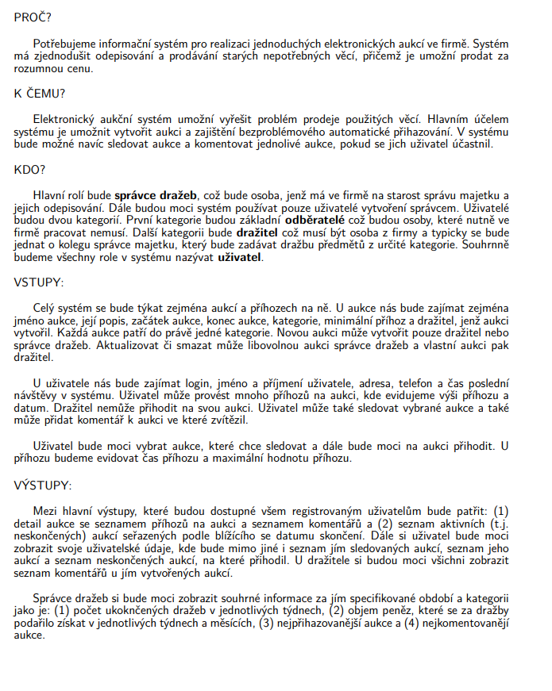
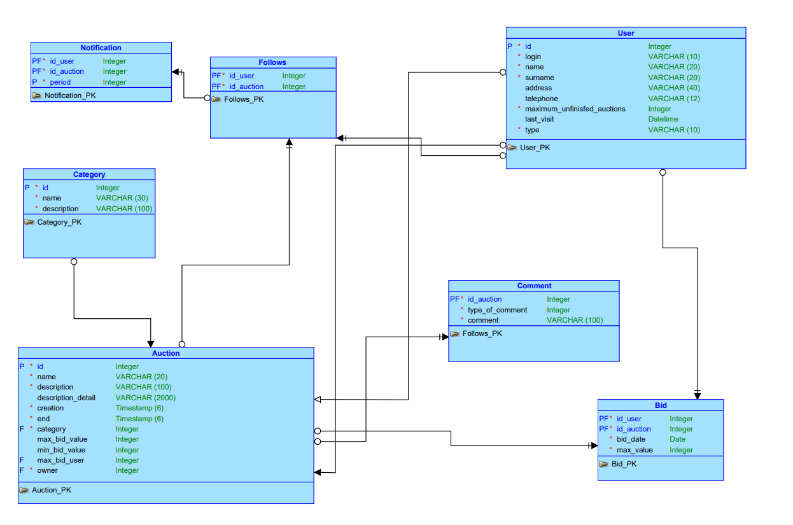
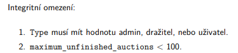

# Materiály - 🗄️ Databázové aplikácie 

* 🗄️ **Názov kurzu:** Databázové aplikácie
* 📘 **Predmet:** DAA
* 🎓 **Trieda:** III.ročník
* 💬 **Discord:**  [SPŠ DISCORD](https://discord.gg/aBdKe6Pe)

   

## **Popis:**  
>   
> Cieľom kurzu je osvojenie si základov práce s SQL databázovými systémami. Naučíte sa pracovať s databázami od úplnych základov pomocou GUI až po písanie vlastných pokročilejších databázových scriptov. Naučíte sa ako vkladať, mazať, editovať a dotazovať dáta z databázy (tzv. CRUD operácie). Taktiež sa pozrieme na to ako správne navrhnúť *relačnú databázu* ktorá môže byť použitá v skutočnej aplikácii. V druhej časti kurzu sa pozrieme na webové technológie Php a HTML/CSS/JS. Pomocou týchto technológii skúsime aplikovať novo získané skúsenosti z databáz na nejakých appkách v praxi prepojením front-endu a back-endu.
>    

 

## **Prerequisites**
* 🧠 Logické myslenie
* 👨‍💻 Základy programovania v ľubovolnom jazyku sú *výhodou*
* 🏴󠁧󠁢󠁥󠁮󠁧󠁿 Základy angličtiny
* 🔎 **Vedieť používať Google**    

 

## **Nástroje ktoré budeme využívať:**
* Apache + Mysql server
    * [XAMP](https://www.apachefriends.org) ⭐⭐⭐⭐
    * [MAMP](https://www.mamp.info/en/windows/) ⭐⭐⭐⭐⭐
    * [WAMP](https://www.wampserver.com/en/)  ⭐⭐⭐
* Softwér pre prácu s databázou
    * *FREE*:
        * [HeidiSQL](https://www.heidisql.com/download.php) - Pre Windows ⭐⭐⭐
        * [SEQUELPRO](https://www.sequelpro.com/) - Pre Mac ⭐⭐⭐⭐
    * *PROFFESSIONAL*:
        * [Datagrip](https://www.jetbrains.com/datagrip/?source=google&medium=cpc&campaign=1700946452&gclid=CjwKCAjwndCKBhAkEiwAgSDKQckahJuWb0nYZsQExEQQsd9MagFtaqXVQ6q-Dddauq56WquFv9QUVxoCB5MQAvD_BwE) - Platené, ale pre študentov sa dá získať PRO verzia z darma pomocou ISIC kartičky. ⭐⭐⭐⭐⭐
        * [Microsoft SQL server managment studio](https://docs.microsoft.com/en-us/sql/ssms/download-sql-server-management-studio-ssms?view=sql-server-ver15) ⭐⭐⭐⭐⭐
* Vývojové prostredie
    * [VS Code](https://code.visualstudio.com/) - ALL IN ONE riešenie ⭐⭐⭐⭐⭐
    * [PhpStorm](https://www.jetbrains.com/phpstorm/download/#section=windows) - Primárne pre PHP. Platené ale lepšie ako VS Code. Pomocou ISIC možné získať zdarma for education. ⭐⭐⭐⭐⭐
    * [WebStorm](https://www.jetbrains.com/webstorm/) - Primárne pre HTML/CSS/JS. Platené ale lepšie ako VS Code. Pomocou ISIC možné získať zdarma for education. ⭐⭐⭐⭐⭐

   

## **Prehľad učiva**
| **1. polrok** | **Téma** | **2.Polrok** | **Téma** |
|---------------|----------|--------------|----------|
| 1.| Úvod + Poučenie  | 17. |-|
| 2.| Databázové systémy  | 18. |-|
| 3.| Relačná databáza, tabuľka, záznam, primárny kľúč  | 19. |-|
| 4.| SQL jazyk - CRUD operácie (CUD)  | 20. |-|
| 5.| SQL jazyk - CRUD operácie (R)  | 21. |-|
| 6.| - | 22. | - |
| 7.| - | 23. | - |
| 8.| - | 24. | - |
| 9.| - | 25. | - |
| 10.| - | 26. |-|
| 11.| -  | 27. |-|
| 12.| -  | 28. |-|
| 13.| -  | 29. |-|
| 14.| -  | 30. |-|
| 15.| -  | 31. |-|
| 16.| -  | 32. |-|

   

## **Systém Hodnotenia**

>    
>  Hodnotenie 1. časti sa skaldá z dvoch testov z jazyka SQL a projektu v ktorom vytvoríte funkčnú databázu. 
>  Hodnotenie 2. časti sa skladá z projektu v ktorom si vytvoríte frontendovú webovú aplikáciu (stránku) za pomocou technológii HTML/CSS/JS. A Druhého projektu v ktorom si naprogramujete webovú aplikáciu za pomocou technológie Php. Zároveń v 2 časti budú 2 Testy zamerané práve na spomínané webové technológie technoogie. 
>        

 

### **1. časť**
* **Test č. 1** -> Test zameraný na SQL jazyk. Vašou úlohou bude zvládnuť základné operácie v SQL jazyku a to **vytvoriť databázu, tabuľku, základné CRUD operácie**. Preukázať schopnosť používať kľúčové slovíčka **WHERE, LIMIT, BETWEEN, IN, LIKE, ORDER BY, GROUP BY, AGREGAČNÉ FUNKCIE.**

* **Test č. 2** -> Test bude zameraný na pokročilejšie selecty. To znamená, že sa v teste môžu objaviť selecty zamerané na **joinovanie tabuliek, poddotazy, klauzula HAVING** a samozrejme aj všetko ostatné z predchádzajúceho testu týkajúce sa selectov.

* **Projekt** -> Cieľom je navrhnúť databázu zameranú na nejakú tématiku. Tématikou je myslené napr. databáza školy, filmová databáza, knižnica, letisko... Téma by mala byť zvolená tak, aby ste o nej niečo vedeli. K téme je potrebné vytvoriť **SQL scripty pre vytvorenie a naplnenie databázy + 14 Selectov do databázy** (popísané nižšie) a **ER diagram** ktorý, popisuje databázu za pomocí schémy ako na obrázku nižšie. Rozsah tabuliek bude 5-10 (nerátame spojovacie tabuľky). K téme je tiež potrebné vytvoriť materiál v dokumente Word. Projektom bude venovaná jedna hodina na kontrolu správnosti ER/Diagramov. Samozrejme je možné o projektoch konzultovať aj počas vyučovania na ostatných hodinách predmetu. Projekt treba odovzdať skrz platformu Github.com s nahratým WORD dokumentom a všetkými scriptami (Script pre vytvorenie a naplnenie databázy a script so selectami).

 

**Word dokument bude obsahovať:**

* **PREČO/NAČO** je váš projekt dobrý. Aký problém rieši. 
* **KDO** a ako bude databázu využívať (podmienka je mať aspoň dva typy uživateľov mimo admina). 
* **Vstupy**, ako popis toho, čo budeme v databázi evidovať (entity a atribúty).
* **Výstupy** ktoré budú z databázy užívatelia získavať. Ideálne 2-3 typy výstupu. V podstate sa jedná o to aké *netriviálne* dotazy užívatelia budú z databázy vyberať pre zobrazenie na stránke alebo pre spracvanie (napr. tlač). 
* **ER Diagram/Konceptuálny model databázy**
* **Popis jednotlivých atribútov tabuliek vrátane integritného obmedzenia** 

 

**14 SQL dotazov bude vyzerať následovne:**

* 4 selecty so zákaldným výpisom hodnôt z tabuliek a triedenia záznamov. Aspoň dva budú obsahovať aritmetickú funkciu alebo inú funkciu pre prácu s hodnotami. Dva selecty budú obsahovať order by a jeden z nich bude triediť podľa vypočítanej hodnoty získanej nejakou funkciou.
* 3 selecty zamerané na výpis riadkov pomocou klauzuly WHERE. Jeden dotaz bude obsahovať kombináciu operátorov AND a OR. Jeden bude obsahovať negáciu. Jeden operátor LIKE a regulárny výraz.
* 3 selecty s agregačnými funkciami a zhlukovaním (GROUP BY). Každý select musí obsahovať nejakú agregačnú funkciu. 2 selecty musia obsahovať GROUP BY a jeden select musí obsahovať HAVING.
* 2 Selecty ktoré spájajú tabuľky pomocou JOIN. Musia obsahovať GROUP BY A WHERE klauzule alebo HAVING klauzulu.
* 2 Selecty ktoré budú kombinovať minimálne dva selecty dokopy (poddotazy).
* Každý select označte vo formáte č. kategórie|poradie v kategórii a popíšte slovne čo má select vyberať. (Ako komentár nad selectom)

 

#

### **2. časť**
